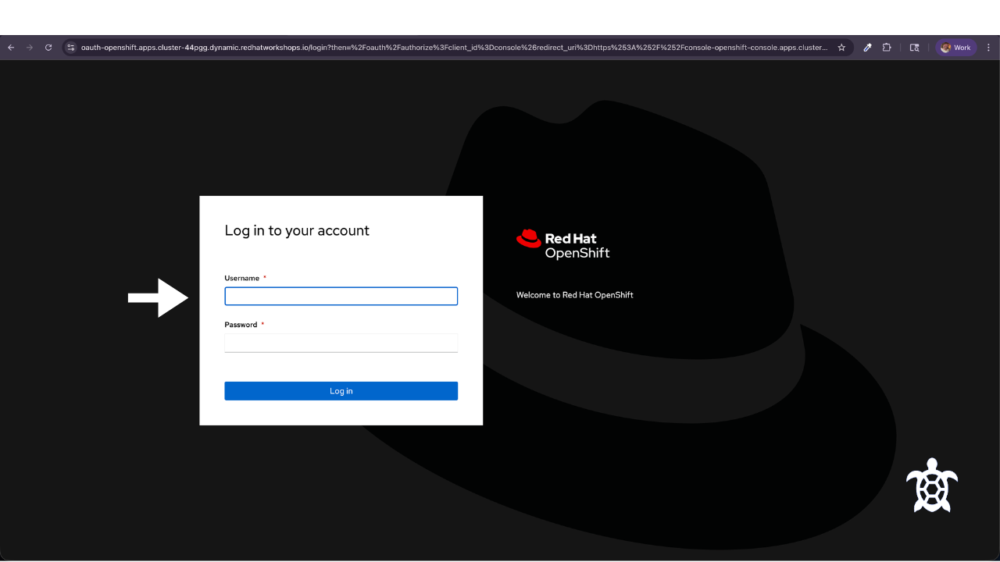
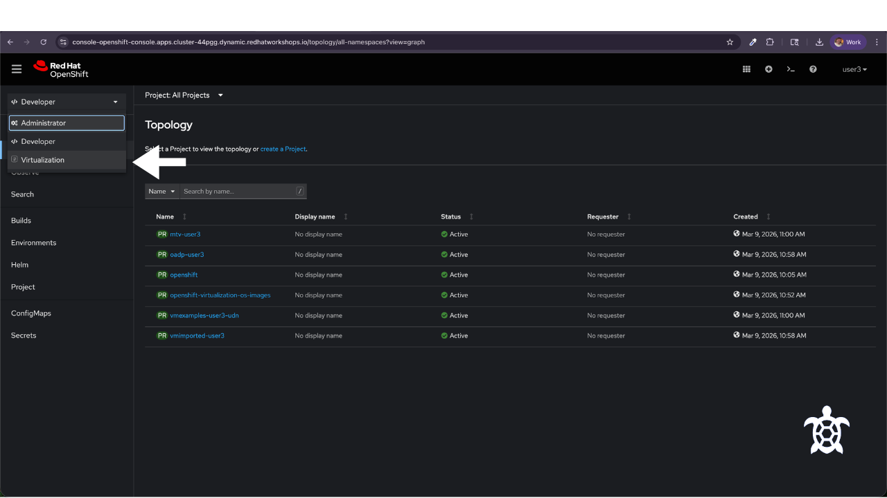
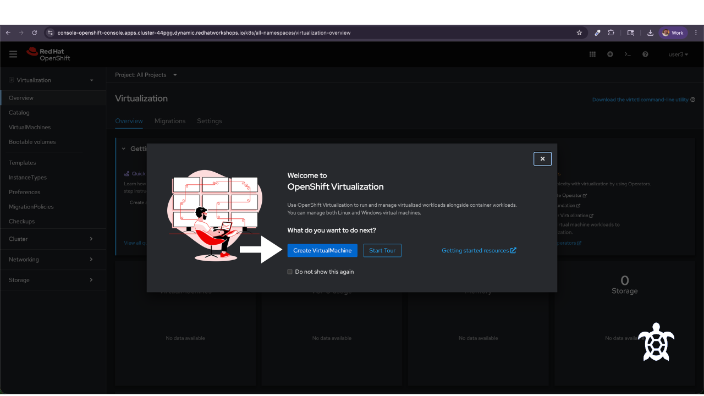
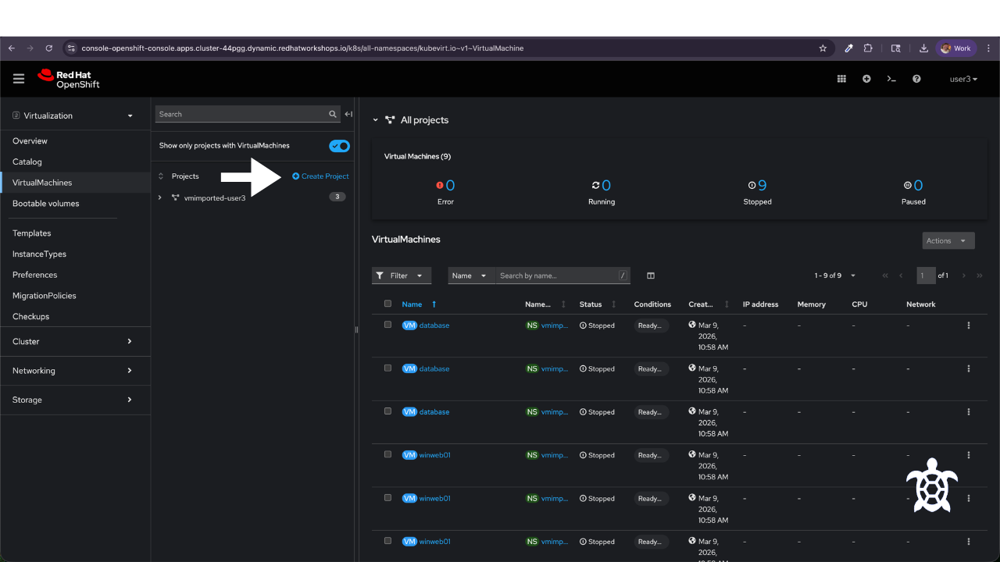
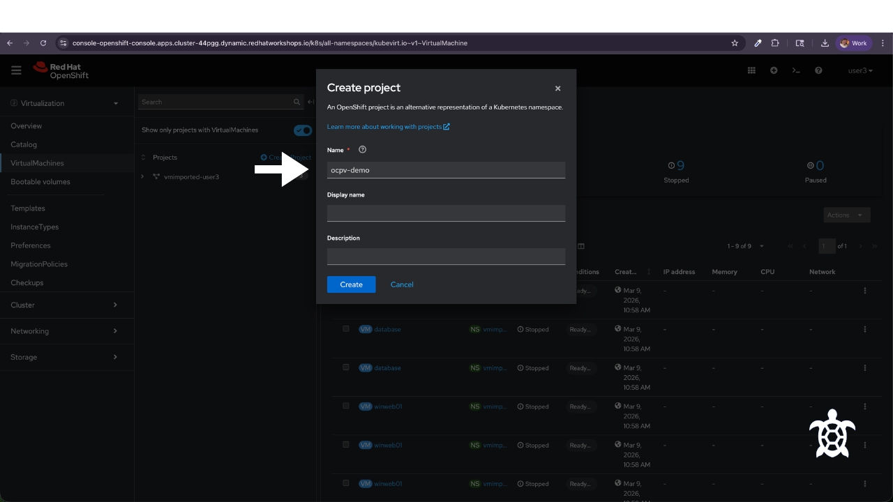
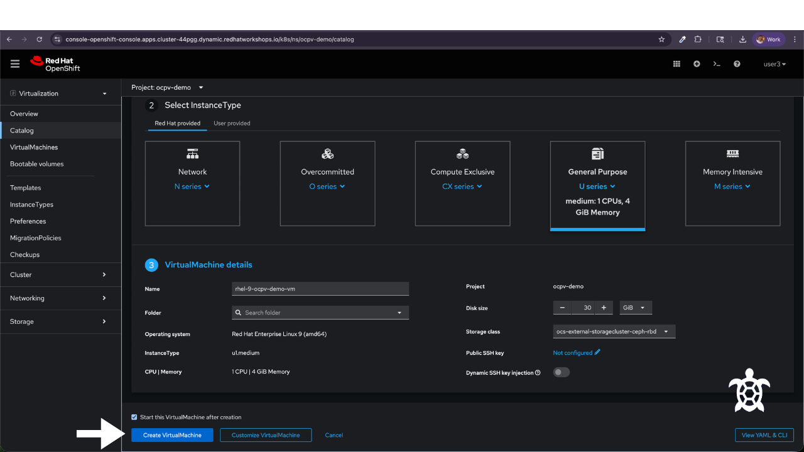
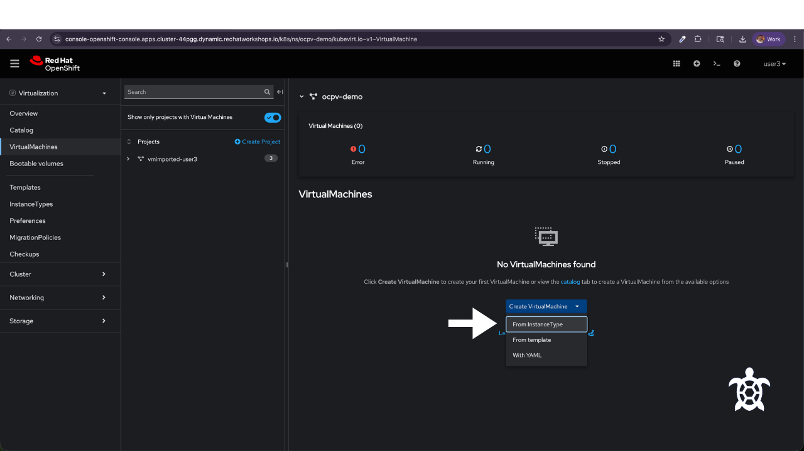

## OpenShift Virtualization Demo

This guide walks through the process of creating a virtual machine using OpenShift Virtualization.

OpenShift Virtualization allows teams to run traditional virtual machines directly inside a Kubernetes platform, alongside containers and cloud-native workloads.

This demo is designed for learning and training purposes and shows the basic workflow used by engineers to create and run a VM inside OpenShift.

It is part of the **Turtini Training Loop**, a series of short operational guides focused on building practical infrastructure skills.

---

## Overview

In this demo we will:

1. Log into the OpenShift console
2. Navigate to the Virtualization section
3. Create a new virtual machine
4. Configure storage and networking
5. Launch the VM
6. Connect to the virtual machine console

Estimated time: **10–15 minutes**

---

## Architecture Overview

The virtual machine will run inside the Kubernetes cluster using OpenShift Virtualization.

```
User
│
▼
OpenShift Web Console
│
▼
OpenShift Virtualization
│
▼
Virtual Machine
│
▼
Persistent Storage + Networking
```

---

## Step 1 — Log into OpenShift

1. Access today's Lab Environment:

```
https://console-openshift-console.apps.cluster-44pgg.dynamic.redhatworkshops.io/
```
Your username and password will be provided to you.



2. Switch to the **Virtualization** perspective



You should now see the OpenShift dashboard along with a popup to **Create a VirtualMachine** unless the popup has been disabled.



---

## Step 2 — Navigate to Virtualization (Skip if you were able to click on **Create a VirtualMachine** from the popup)

From the left navigation menu:

1. Select **VirtualMachines**

This section allows you to create and manage virtual machines within the cluster.

2. Click **+ Create Project**



Name the project **ocpv-demo**



---

## Step 3 — Create a Virtual Machine

Click **Create VirtualMachine**.



Choose **From InstanceType**



Choose under **2 Select Instance Type** General Purpose U Series.

Provide a name for the VM.

Example:

```
rhel-9-ocpv-demo-vm
```

---

## Step 4 — Configure Resources

Set the VM resources.

Recommended demo settings:

CPU: 1
Memory: 1 GiB

These settings are sufficient for most demo workloads.

---

## Step 5 — Storage Configuration

OpenShift will automatically provision storage for the VM disk.

Typical configuration:

* Persistent Volume Claim (PVC)
* Container-native storage
* Cluster storage class

The template will create a Persistent Volume Claim (PVC) using the defaults. You do not have to change the Storage Class for our demo.

Example size: 

```
30 GiB
```

Storage Class example:

```
ocs-external-storagecluster-ceph-rbd
```

---

## Step 6 — Configure Networking

By default, the VM will attach to the pod network. This allows the VM to communicate with other workloads inside the cluster. For this demo, use the default cluster network configuration.

Advanced configurations include:

* Multus networks
* VLAN attachment
* SR-IOV 

The VM will receive a network interface connected to the OpenShift cluster network.

---

## Step 7 — Launch the VM

Click **Create Virtual Machine**.

The platform will begin provisioning the VM and attaching storage and networking.

Provisioning typically takes **30–90 seconds** depending on the cluster.

---

## Step 8 — Access the Console

From the Virtual Machines list:

1. Select the VM
2. Click **Console**

OpenShift will create:

* A Virtual Machine Instance
* A launcher pod
* Attach storage
* Boot the OS

The console provides direct access to the operating system running inside the VM.

---

## Step 9 — Verify the VM

Log into the virtual machine using the credentials configured in the template.

Once logged in, run:

```
uname -a
```

This confirms the VM is running successfully inside the Kubernetes cluster.

Inside the console, also run:

```
hostnamectl
```

OpenShift Virtualization runs VMs using KubeVirt, QEMU, & KVM. The VM runs inside a Kubernetes pod called a virt-launcher. This allows VMs and containers to share the same cluster infrastructure. 

---

## Demo Complete

You have successfully:

* Created a virtual machine inside OpenShift
* Provisioned storage and networking
* Accessed the VM console


---

## Related Demo

A companion guide shows how to create a virtual machine using [**Amazon Web Services**](https://docs.turtini.com/projects/aws-vm-demo/en/latest/README.html#).

Together these demos illustrate the difference between:

* Cloud-based virtual machines
* Virtual machines running inside Kubernetes


